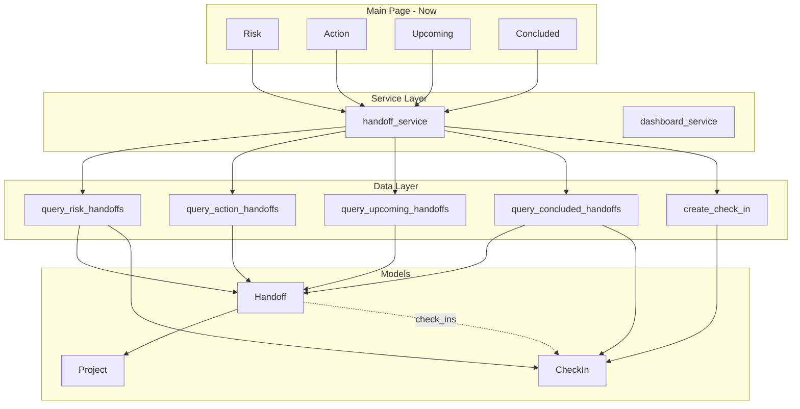

# Handoff Check-in Paradigm Shift

## Summary

Full paradigm shift: **Todo to Handoff**, with **CheckIn trail**. A handoff is open until it has a `concluded` check-in. Check-ins drive the workflow: when the check-in date arrives, the user must choose on-track, delayed, or conclude. The main page has four sections: **Risk** | **Action** | **Upcoming** | **Concluded**. Goal: minimize risks by clearing actions on time. Projects remain; handoffs reference projects. Projects can be archived (hidden); handoffs never store archival state. Use `pitchman` and `need_back` throughout. "Me" is just another value in pitchman—no special handling.

---

## Naming (Final)


| Concept            | Column/field |
| ------------------ | ------------ |
| Person responsible | `pitchman`   |
| Deliverable/task   | `need_back`  |


---

## Data Model Changes

### 1. New CheckIn Model

```python
class CheckInType(StrEnum):
    ON_TRACK = "on_track"
    DELAYED = "delayed"
    CONCLUDED = "concluded"

class CheckIn(SQLModel, table=True):
    id: int | None = Field(default=None, primary_key=True)
    handoff_id: int = Field(foreign_key="handoff.id", index=True)
    check_in_date: date
    note: str | None = None
    check_in_type: CheckInType
    created_at: datetime  # for ordering
    handoff: Handoff | None = Relationship(back_populates="check_ins")
```

Handoff model includes: `check_ins: list[CheckIn] = Relationship(back_populates="handoff")` so `handoff.check_ins` loads the trail.

### 2. Handoff Model (full rename from Todo)

**Full migration:** Rename `todo` table to `handoff`, columns: `name` to `need_back`, `helper` to `pitchman`. Remove `status`, `completed_at`, `is_archived`. Add `check_in` table.

**Handoff table:** `id`, `project_id`, `need_back`, `pitchman`, `next_check`, `deadline`, `notes` (context), `created_at`

**Check-in trail at model layer:** Use `Handoff.check_ins` (SQLModel relationship)—equivalent to `handoff.get_check_ins()` in spirit, but via the ORM relationship. The relationship is the model-layer contract: given a Handoff instance, `handoff.check_ins` gives the trail. No need for `get_check_ins(handoff_id)` in the data layer because that would duplicate what the relationship provides. The data layer focuses on *queries that cross handoffs* (e.g., "handoffs with at least one delayed check-in"); per-handoff trail access stays at the model layer via the relationship. Order check_ins by date/created_at in the relationship or when querying.

**Lifecycle:** A handoff is **open** if it has no check-in with type `concluded`. **Closed** = has at least one concluded check-in. **Close date** = date of last concluded check-in (property or query helper).

### 3. Project Archival

- Projects keep `is_archived`. Handoffs and check-ins do not store archival state.
- Queries filter by project: when `include_archived=False`, exclude handoffs whose project is archived.
- UI: checkbox "Include archived projects" to show all handoffs.

### 4. Full Migration (Todo to Handoff)

**Effort:** Moderate. Single migration script plus global code rename. ~25–30 files touched (models, data, services, pages, tests, backup, migrations).

**Migration m006:**

1. Create `handoff` table: id, project_id, need_back, pitchman, next_check, deadline, notes, created_at.
2. Copy rows from `todo`: name to need_back, helper to pitchman.
3. Create `check_in` table with handoff_id FK.
4. For each todo with status DONE: insert concluded CheckIn (check_in_date from completed_at or today).
5. For each todo with status CANCELED: insert concluded CheckIn with note "canceled".
6. Drop `todo` table.
7. Models: `Handoff` class with `__tablename__ = "handoff"`.

**Code rename:** `Todo` to `Handoff` everywhere. `todo_service` may stay as module name or become `handoff_service`. `BackupTodoRecord` to `BackupHandoffRecord`. `TodoQuery` to `HandoffQuery` (or keep as generic query contract).

---

## Main Page (Dashboard) Reorganization

Four sections: **Risk** | **Action** | **Upcoming** | **Concluded**. Goal: minimize risks by clearing actions on time.


| Section       | Criteria                                                                   | Purpose                                           |
| ------------- | -------------------------------------------------------------------------- | ------------------------------------------------- |
| **Risk**      | `deadline` within N days **AND** has at least one `delayed` check-in, open | At-risk handoffs needing escalation               |
| **Action**    | `next_check <= today` and no concluded check-in                            | Must act now: pick on-track, delayed, or conclude |
| **Upcoming**  | Open, not in Risk or Action                                                | No immediate action                               |
| **Concluded** | Has concluded check-in                                                     | Closed handoffs for reference                     |


**Rationale:** A handoff approaching deadline but on-track is not at risk. Only handoffs that are both approaching deadline *and* have been delayed appear in Risk.

**Ordering:** Within each section, sort by next_check, then deadline. Risk section: by deadline proximity.

**Check-in due flow:** When user opens a handoff with `next_check <= today`, show three buttons: **On-track**, **Delayed**, **Conclude**. Each opens a small form:

- On-track: optional note, date picker for next check-in → create `on_track` CheckIn, update `next_check`.
- Delayed: optional reason, date picker for next check-in → create `delayed` CheckIn, update `next_check`.
- Conclude: optional conclusion note → create `concluded` CheckIn. Handoff lifecycle closed. No `next_check` update.

**Check-in trail view:** Each handoff expander shows its check-in trail. Trail length typically 3–5 check-ins. Each check-in: expander (collapsed by default), header `[type] <date>` or `[type] <date> — <first ~40 chars>` when note exists. Expanded content: full note as rendered markdown (supports multi-line). Use `handoff.check_ins` (ensure relationship is loaded when rendering). Trail visible for both open and concluded handoffs.

Search and filters: Project, Who (pitchman), text search (need_back, context, check-in notes). Include check-in notes in search scope for "Assumption doc X" lookup.

---

## Service and Data Layer Changes

### Data layer ([src/handoff/data.py](src/handoff/data.py))

- `create_check_in(handoff_id, check_in_type, check_in_date, note)` — insert CheckIn, optionally update handoff `next_check`.
- **Check-in trail:** Use `Handoff.check_ins` (ORM relationship). No separate `get_check_ins()`. Ensure `selectinload(Handoff.check_ins)` when loading handoffs for the main page so the trail is available.
- `handoff_is_open(handoff)` — no concluded check-in.
- `get_handoff_close_date(handoff)` — date of last concluded check-in, or None.
- Replace `query_now_items` with section-specific queries: `query_risk_handoffs` (deadline approaching AND has delayed check-in), `query_action_handoffs` (next_check <= today, open), `query_upcoming_handoffs`, `query_concluded_handoffs`.
- Update `query_handoffs` (renamed from query_todos): "open" = no concluded check-in. Use `include_concluded` or similar.
- Search: extend to `CheckIn.note` (JOIN check_in). Use `pitchman` instead of helper.

### Service layer ([src/handoff/services/todo_service.py](src/handoff/services/todo_service.py) or handoff_service.py)

- `add_check_in(handoff_id, check_in_type, note, next_check_date?)` — create check-in, update handoff `next_check` when not concluded.
- `conclude_handoff(handoff_id, note)` — add concluded check-in.
- Replace `complete_todo` with `conclude_handoff`.
- Provide section queries: risk, action, upcoming, concluded (or one function returning a structured result).

### Dashboard service ([src/handoff/services/dashboard_service.py](src/handoff/services/dashboard_service.py))

- **Cycle time:** Use `get_handoff_close_date` (from last concluded check-in) instead of `completed_at`.
- **On-time rate:** Compare close date vs deadline.
- **Throughput:** Count handoffs with concluded check-in in date range.
- **Pitchman load:** Open handoffs per pitchman (no concluded check-in).

---

## Backup and Export

- [backup_schema.py](src/handoff/backup_schema.py): Rename `BackupTodoRecord` to `BackupHandoffRecord` (need_back, pitchman). Add `BackupCheckInRecord` (handoff_id, check_in_date, note, check_in_type, created_at). Extend `BackupPayload` with `handoffs` and `check_ins`.
- Import: validate and restore handoffs, then check-ins.

---

## Files to Modify (High Level)


| Area       | Files                                                                          |
| ---------- | ------------------------------------------------------------------------------ |
| Models     | `models.py` — Handoff (rename Todo), CheckIn, CheckInType; pitchman, need_back |
| Migrations | `migrations/scripts/m006*.py` — full Todo to Handoff migration, check_in table |
| Data       | `data.py` — Handoff CRUD, check-in CRUD, section queries, pitchman/need_back   |
| Services   | `todo_service` or `handoff_service`, `dashboard_service`                       |
| Backup     | `backup_schema.py` — BackupHandoffRecord, BackupCheckInRecord                  |
| Pages      | `now.py` — four sections, check-in flow, check-in trail in expander            |
| Search     | Extend data layer to search check-in notes                                     |
| Tests      | All tests touching Todo, backup, dashboard, now page                           |


---

## Architecture Diagram




---

## Implementation Phases

Each phase is sized for a single agent run: includes implementation, tests, documentation, and logical commits.

---

**Phase 1 — Atomic cutover (Todo to Handoff)**

Migration m006, models (Handoff, CheckIn, CheckInType), data layer (Handoff CRUD, create_check_in, query_handoffs, handoff_is_open, get_handoff_close_date), service layer, backup schema (BackupHandoffRecord, BackupCheckInRecord, import/export). Global rename: Todo to Handoff, helper to pitchman, name to need_back. Now page: update to use new types and show four sections (Risk, Action, Upcoming, Concluded) using placeholder queries that return empty or minimal data until section queries exist. Tests: migration, models, data. Commit(s): migration; models and data; services and backup; page wiring; tests.

*Deliverable:* App runs. DB uses handoff/check_in. All references use Handoff, pitchman, need_back. Section queries stubbed or minimal.

---

**Phase 2 — Section queries and check-in flow**

Data layer: query_risk_handoffs, query_action_handoffs, query_upcoming_handoffs, query_concluded_handoffs. Service layer: wrappers, add_check_in, conclude_handoff. Now page: four sections with real data; check-in flow (On-track, Delayed, Conclude buttons and forms); check-in trail with expanders (markdown). Remove placeholder logic from Phase 1. Tests: section queries, check-in CRUD, Now page. Commit(s): section queries; check-in flow and trail; tests.

*Deliverable:* Full Now page with Risk | Action | Upcoming | Concluded and check-in workflow.

---

**Phase 3 — Dashboard, search, and filters**

Dashboard service: cycle time, on-time rate, throughput, pitchman load from concluded check-ins. Data layer: extend search to CheckIn.note. Now page: "Include archived projects" checkbox. Tests: dashboard, search. Commit(s): dashboard metrics; search and filters; tests.

*Deliverable:* Dashboard reflects new model. Search includes check-in notes. Archived filter available.

---

**Phase 3.1 — Lifecycle alignment, reopen flow, and PM metrics**

This phase tightens behavior before docs/polish so user expectations match app behavior.

### Phase 3.1 implementation spec

1. **Append-only reopen (no history deletion)**
   - Reopen must append a new check-in after a prior `concluded` check-in.
   - Do **not** delete or mutate existing concluded check-ins.
   - Reopen note is captured in check-in notes (e.g., "reopen: waiting on revised doc").

2. **Lifecycle semantics update**
   - Replace "closed if any concluded check-in exists" with:
     - **Closed** = latest check-in is `concluded`.
     - **Open** = no check-ins, or latest check-in is `on_track`/`delayed`.
   - Update all query paths and counters that currently depend on `exists(concluded)`.
   - Preserve `get_handoff_close_date` semantics for analytics (most recent concluded date).

3. **Check-in flow on all open sections**
   - Show check-in actions on Risk, Action, and Upcoming items.
   - Keep due-state emphasis for items with `next_check <= today`.
   - Support optional early check-ins for non-due items.
   - Concluded section gets a dedicated reopen action.

4. **Check-in date behavior**
   - User-triggered check-ins use actual action date (`today`) as `check_in_date`.
   - `next_check` remains a planning field, not a proxy for check-in date.
   - Late and early check-ins both record the real check-in date (`today`).

5. **Dashboard PM metrics focus**
   - Prioritize PM-operational signals over raw throughput deltas:
     - At risk now
     - Action overdue
     - Open aging profile
     - On-time close rate trend
     - Cycle time by project (p50/p90)
     - Reopen rate
   - Keep export path aligned with the updated metrics model.

### Phase 3.1 execution steps (one agent per step)

Run each step as a separate agent run on top of the previous step's merged branch.
Each step should produce focused commits, tests, and a short handoff note for the next step.

#### Step 3.1-A — Lifecycle predicates + reopen backend

- **Goal:** Introduce latest-check-in lifecycle semantics and append-only reopen APIs.
- **Primary files:**
  - `src/handoff/data.py`
  - `src/handoff/services/handoff_service.py`
  - `src/handoff/services/__init__.py`
  - `tests/test_data.py`
  - `tests/test_todo_service.py`
- **Scope:**
  - Add latest-check-in helper/predicate(s) and replace `exists(concluded)` open/closed logic.
  - Add `reopen_handoff(...)` service/data functions (append non-concluded check-in, set `next_check`).
  - Update list/count/query helpers to use current lifecycle state.
- **Validation target:**
  - Data/service tests for conclude -> reopen -> open again.
  - Regression tests for risk/action/upcoming/concluded membership.
- **Token budget guidance:** ~12k-18k tokens.

#### Step 3.1-B — Now page UX (all-open-section check-ins + reopen action)

- **Goal:** Align interaction model with lifecycle changes and user expectations.
- **Primary files:**
  - `src/handoff/pages/now.py`
  - `tests/test_pages_now.py`
  - `tests/test_app_integration.py` (Now-page flows only)
- **Scope:**
  - Enable check-in controls on Risk, Action, Upcoming sections.
  - Preserve due messaging for due items; allow optional early check-in on non-due items.
  - Add reopen action/form in Concluded section using append-only behavior.
  - Ensure check-in save feedback clarifies "checked in today; next check set to ...".
- **Validation target:**
  - Page/unit tests for new controls.
  - AppTest flow: conclude -> reopen -> item moves out of Concluded.
- **Token budget guidance:** ~10k-16k tokens.

#### Step 3.1-C — Dashboard PM metric redesign

- **Goal:** Shift analytics from generic counts to PM-operational health metrics.
- **Primary files:**
  - `src/handoff/services/dashboard_service.py`
  - `src/handoff/pages/dashboard.py`
  - `tests/test_dashboard.py`
  - `tests/test_dashboard_render.py`
- **Scope:**
  - Add PM cards (at-risk now, action overdue, etc.) and aging/reopen metrics.
  - Rework chart/table sections around reliability and flow.
  - Keep exports coherent with revised metric definitions.
- **Validation target:**
  - Deterministic service tests for each new metric.
  - Render tests for updated dashboard sections.
- **Token budget guidance:** ~12k-20k tokens.

#### Step 3.1-D — Integration hardening + release-plan sync

- **Goal:** Ensure cross-module correctness and lock expected behavior.
- **Primary files:**
  - `tests/test_app_integration.py`
  - `tests/test_data.py` (final edge-case additions)
  - `RELEASE_NOTES.md` (new 2026.3.10 draft block if needed)
  - `release-2026-3-10-plan.md` (mark step completion notes)
- **Scope:**
  - Add end-to-end tests covering late/early check-in, reopen, and dashboard metrics smoke.
  - Verify archived-project toggle interactions under new lifecycle semantics.
  - Update plan/release note checkpoints so Phase 4 docs can be finalized quickly.
- **Validation target:**
  - Targeted integration tests pass from project root.
  - No regressions in existing now/dashboard/project workflows.
- **Token budget guidance:** ~8k-14k tokens.

### Phase 3.1 done criteria

- Reopen is append-only and works functionally.
- Open/closed state is based on latest check-in, consistently across UI + data + services.
- Risk/Action/Upcoming support check-in actions with correct "real check-in date is today" behavior.
- Dashboard emphasizes PM-operational metrics.
- Targeted tests for data, page render, and app integration are green.

---

**Phase 4 — Documentation and final polish**

AGENTS.md: update terminology (Handoff, pitchman, need_back, check-in trail). README: any user-facing changes. RELEASE_NOTES: entry for paradigm shift. Integration tests. Commit: docs and polish.

*Deliverable:* Docs updated. All tests pass. Ready for release.